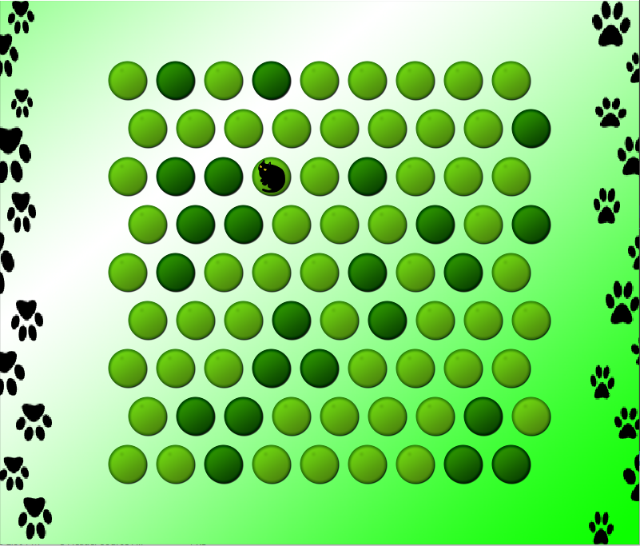

# Circle The Cat

<p align="center"><br><br></p>

This is an implementation of the __Circle the Cat__ game using __SDL__

## Dependencies
- Git
- C11 Compiler
- CMake
- [SDL 2 Library](https://www.libsdl.org/)
- [SDL 2 Image Library](https://www.libsdl.org/projects/SDL_image)
- [SDL 2 TTF Library](https://www.libsdl.org/projects/SDL_ttf)

## Build Instructions
```bash
git clone https://github.com/zeralight/catsdl.git
cd catsdl
mkdir build
cd build
cmake .. -DSDL2_PATH=... -DSDL2_IMAGE_PATH=... -DSDL2_TTF_PATH=...

# Run the game
./circle_the_cat
```